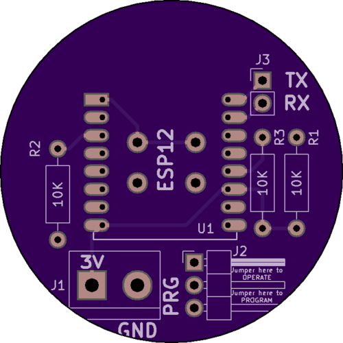
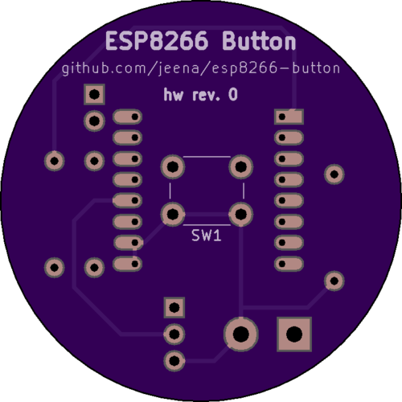

# ESP8266-button PCB
The PCB schematics and layout of the ESP8266-button made with [KiCad](http://kicad-pcb.org/).

## Board render
### Top

### Bottom

## Components
* ESP12 WiFi module
* 3 x 10KΩ resistors
* Screw terminal (5.08mm)
* Tactile on/off switch (6x6mm)
* 3-pin male angled header
* 2-pin male or female straight header
